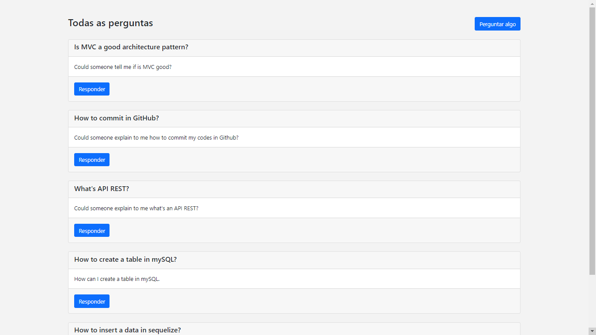

# Frequently Asked Questions


If you want to take a look on all screens of the application, they are [here](https://drive.google.com/drive/folders/1coGkes2o5RW05Zbn2tUtObuSdeeNMTXQ?usp=sharing).

## About this project

The idea of the application is:

_"It's an application for frequently asked questions"_

## Why?

This project is part of my personal portfolio, it was developed during a course, powered by Udemy, that's called Formação NodeJS. I'll be happy if you could send me any feedback about the project, code, structure or anything that you can report that could make me better as a developer!

Reach me at: bwesleysouza@gmail.com

Connect with me at [LinkedIn](https://www.linkedin.com/in/bwesleysouza).

And you can use this project as you wish!

## Some Observations about this App

- There isn't a functionality of Login/Register

## Functionalities

- Ask something that you aren't sure about.
- Answer something that you know about.
- 

## Getting started

### Installing

**Cloning the Repository**

```
$ git clone git@github.com:SouzaWesley/faq.git

$ cd faqClone
```

**Dependencies**

```
$ yarn install
```

_or_

```
$ npm install
```

### Creating a databse

You'll need to create an database in mySQL Workbench or by the mySQL cmd. After you created it, just configurate the config.js file inside the database folder. After the files that are inside the Model folder will create the tables.

### Running

With all dependencies installed, the database created and the environment properly configured, you can now run the application:

```
$ npm run dev
```

```
$ yarn run dev
```

The project will be locate at the port **localhost:3000**, but you can configure.

## Build with

- [Express](http://expressjs.com/) - Complements NodeJS with some web application features
- [mySQL2](https://sqlite.org/index.html) - Used to create the database
- [EJS](https://ejs.co/) - Used to let JavaScript's code in HTML
- [Bootstrap4](https://getbootstrap.com/) - Used to fast style all the pages
- [Sequelize](https://sequelize.org/) - Used to manage versions of the database primarily SQL database

## Support tools

- [Nodemon](https://nodemon.io/) - Reloads the application

## Contribuing

It was developed by me during my Formação NodeJS course. I'll be glad to receive any feedback about something that a I need to redo. And if you have any question....

Reach me at: bwesleysouza@gmail.com

_or_

Try it: [LinkedIn](https://www.linkedin.com/in/)

Thank you!

## License

This project is licensed under the MIT License - see the [LICENSE.md](./LICENSE.md) file for details.
